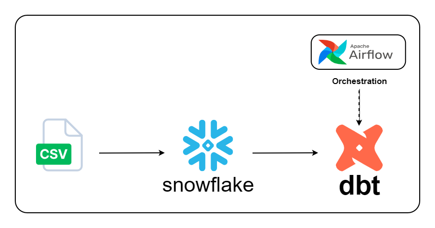
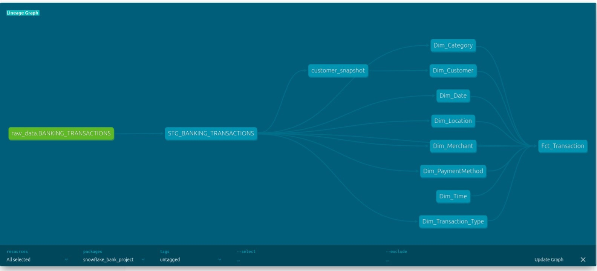
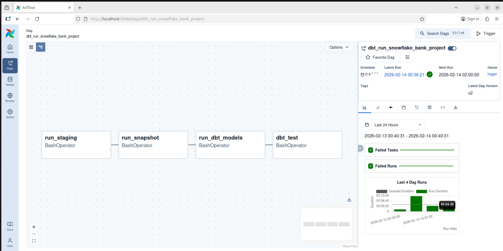

# Banking Data Warehouse — Snowflake, dbt & Airflow

## 📌 Project Overview

This project implements an end-to-end banking data warehouse using **Snowflake**, **dbt Core**, and **Apache Airflow**.

The project includes:

* Loading raw transaction data into the Snowflake RAW layer.
* Building a staging layer using dbt for data cleaning and transformation.
* Implementing data quality tests using dbt tests.
* Tracking customer changes using dbt Snapshots (**SCD Type 2**).
* Creating dimension and fact tables for analytics.
* Orchestrating the dbt transformation workflow using Apache Airflow.

The final warehouse provides a reliable and organized structure for analyzing banking transactions, customer information, merchants, payment methods, and transaction attributes.

---

## 🏗️ Architecture

The project follows a layered data warehouse architecture that transforms raw banking transaction data into an analytics-ready **Star Schema**.

The transformation flow consists of the following layers:

* **Snowflake RAW Layer** — Stores the raw banking transaction data.
* **dbt Staging Layer** — Cleans and standardizes the raw data.
* **dbt Snapshot** — Tracks customer changes over time using SCD Type 2.
* **Marts Layer** — Builds the analytical dimension and fact models.
* **Star Schema** — Provides the final analytics-ready warehouse structure.

### Data Pipeline

```text
Snowflake RAW
      │
      ▼
dbt Staging
      │
      ▼
dbt Snapshot
      │
      ▼
dbt Marts
      │
      ▼
Star Schema
```



---

## 🔗 dbt Data Lineage

The dbt models transform the raw banking transaction data through the staging layer and into the analytical dimensions and fact table.

The lineage represents the dependencies between:




---

## 🛠️ Tech Stack

| Technology         | Purpose                                                    |
| ------------------ | ---------------------------------------------------------- |
| **Snowflake**      | Cloud data warehouse for storing raw and transformed data  |
| **dbt Core**       | Data transformation, data modeling, testing, and snapshots |
| **Apache Airflow** | Workflow orchestration and scheduling                      |
| **SQL**            | Data cleaning, transformation, and warehouse modeling      |
| **Python**         | Airflow DAG development and exploratory data analysis      |
| **Pandas**         | Exploratory data analysis and dataset exploration          |

---

## 📊 Data Source

The dataset was sourced from Kaggle and contains banking transactions from **2023–2024**.

It includes **5,389 transaction records** and **20 attributes** covering:

* Transaction details
* Customer information
* Merchants
* Categories
* Locations
* Payment methods
* Account balances
* Fraud indicators
* Loyalty points

The dataset was explored using **Python and Pandas** to understand its structure, validate data quality, identify candidate keys, and inspect categorical fields before building the warehouse models.

The data was then loaded into the `RAW` schema in Snowflake and used as the source for the dbt staging layer.

---

## 🧹 Data Cleaning

Data cleaning and standardization are performed in the dbt staging layer.

The staging model applies transformations such as:

* Trimming and standardizing text fields.
* Converting transaction dates to timestamps.
* Standardizing transaction status, fraud flags, and discount indicators.
* Standardizing customer occupation values.
* Preparing the raw data for downstream analytical models.

---

## 📁 Folder Structure

```text
snowflake_bank_project/
│
├── airflow/
│   └── dbt_dag.py
│
├── data/
│   └── Banking_Transactions_USA_2023_2024.csv
│
├── docs/
│   ├── Airflow DAG Overview.jpg
│   ├── airflow_workflow.jpg
│   ├── data_pipeline_architecture.jpg
│   └── dbt_data_lineage.jpg
│
├── models/
│   ├── staging/
│   │   ├── STG_BANKING_TRANSACTIONS.sql
│   │   ├── STG_BANKING_TRANSACTIONS.yml
│   │   └── sources.yml
│   │
│   └── marts/
│       ├── Dim_Customer.sql
│       ├── Dim_Date.sql
│       ├── Dim_Time.sql
│       ├── Dim_Category.sql
│       ├── Dim_Merchant.sql
│       ├── Dim_PaymentMethod.sql
│       ├── Dim_Transaction_Type.sql
│       ├── Dim_Location.sql
│       └── Fct_Transaction.sql
│
├── notebooks/
│   └── banking_transactions_eda.ipynb
│
├── snapshots/
│   └── customer_snapshot.sql
│
├── dbt_project.yml
├── packages.yml
├── package-lock.yml
├── .gitignore
└── README.md
```

---

## ⭐ Star Schema

The analytical layer follows a **Star Schema** design, where a central fact table is connected to multiple dimension tables.

### Fact Table

**`Fct_Transaction`**

The fact table stores transaction-level records and contains foreign keys that link transactions to the related dimension tables.

### Measures

The fact table contains the following measures and transaction attributes:

* Transaction amount
* Discount applied
* Loyalty points earned
* Fraud flag
* Transaction status

### Dimension Tables

The fact table is connected to the following dimension tables:

* `Dim_Customer`
* `Dim_Date`
* `Dim_Time`
* `Dim_Category`
* `Dim_Merchant`
* `Dim_PaymentMethod`
* `Dim_Transaction_Type`
* `Dim_Location`

This dimensional model organizes banking transaction data and enables analytical queries across different business perspectives.

---

## ⚙️ Airflow Orchestration

Apache Airflow is used to orchestrate and schedule the **dbt transformation workflow**.

The DAG controls the execution order of the dbt tasks and ensures that each task runs after the previous task completes successfully.

The workflow execution order is:

```text
run_staging
      │
      ▼
run_snapshot
      │
      ▼
run_dbt_models
      │
      ▼
dbt_test
```

### DAG Tasks

| Task             | Description                                                         |
| ---------------- | ------------------------------------------------------------------- |
| `run_staging`    | Executes the dbt staging model `STG_BANKING_TRANSACTIONS`           |
| `run_snapshot`   | Executes dbt snapshots to track historical changes using SCD Type 2 |
| `run_dbt_models` | Runs the remaining dbt models excluding the staging model           |
| `dbt_test`       | Executes dbt tests to validate data quality                         |

The Airflow DAG is scheduled to run daily with `catchup=False`.




---

# 🚀 Setup & Run

Follow these steps to set up and run the project locally.

## 1. Prerequisites

Make sure you have:

* Python 3
* Git
* A Snowflake account
* Ubuntu/Linux environment

---

## 2. Clone the Repository

Clone the project from GitHub and move into the project directory:

```bash
git clone https://github.com/hageressam1/banking-data-warehouse-dbt-snowflake.git
cd banking-data-warehouse-dbt-snowflake
```

---

## 3. Create the Python Environment

Create and activate the virtual environment used by dbt and Airflow:

```bash
python3 -m venv dbt-env
source dbt-env/bin/activate
```

Verify Python:

```bash
python --version
```

---

## 4. Install dbt

Install dbt Core with the Snowflake adapter:

```bash
pip install dbt-snowflake
```

Verify the installation:

```bash
dbt --version
```

Install the project's dbt packages:

```bash
dbt deps
```

---

## 5. Configure dbt → Snowflake

dbt connects to Snowflake through:

```text
~/.dbt/profiles.yml
```

Create or configure the profile with your own Snowflake credentials:

```text
account
user
password
role
warehouse
database
schema
threads
```

For this project:

```text
Database: DB_BANK
Warehouse: DWH
Schema: RAW
```

Test the connection:

```bash
dbt debug
```

The connection should be successful before running the project.

---

## 6. Prepare the Snowflake RAW Layer

Before running dbt, load the source CSV into Snowflake.

1. Open the Snowflake UI and select the `RAW` schema.
2. Use **Load Data** to upload:

```text
Banking_Transactions_USA_2023_2024.csv
```

3. Load the data into the table:

```text
BANKING_TRANSACTIONS
```

The project expects the source table:

```text
DB_BANK.RAW.BANKING_TRANSACTIONS
```

The table is configured as a dbt source in:

```text
models/staging/sources.yml
```

The RAW table stores the original banking transaction data and is used as the source for the dbt staging layer.

---

## 7. Install Apache Airflow

Make sure the virtual environment is active:

```bash
source dbt-env/bin/activate
```

Install Airflow and the Snowflake provider:

```bash
pip install apache-airflow
pip install apache-airflow-providers-snowflake
```

Set the Airflow home directory:

```bash
export AIRFLOW_HOME=~/airflow
```

Create the DAG directory:

```bash
mkdir -p ~/airflow/dags
```

---

## 8. Add the Project DAG to Airflow

The DAG is stored in the repository at:

```text
airflow/dbt_dag.py
```

Copy it to Airflow's DAG directory:

```bash
cp airflow/dbt_dag.py ~/airflow/dags/
```

The repository version is kept under Git for version control, while Airflow reads the DAG from:

```text
~/airflow/dags/
```

---

## 9. Start Airflow

Start Airflow in standalone mode:

```bash
airflow standalone
```

Open the Airflow UI:

```text
http://localhost:8080
```

Get the generated login password with:

```bash
cat ~/airflow/simple_auth_manager_passwords.json.generated
```

After logging in, find the DAG:

```text
dbt_run_snowflake_bank_project
```

---

## 10. Run and Monitor the Pipeline

Open the DAG in the Airflow UI and click **Trigger DAG** to start a run.

The DAG executes the dbt workflow in the following order:

```text
run_staging
      │
      ▼
run_snapshot
      │
      ▼
run_dbt_models
      │
      ▼
dbt_test
```

You can monitor:

* DAG run status
* Task status
* Task logs

The pipeline must complete the tasks in order, with each task depending on the successful completion of the previous task.

---

## 11. Manual dbt Execution

The same workflow can also be executed manually without Airflow:

```bash
source dbt-env/bin/activate
cd /path/to/banking-data-warehouse-dbt-snowflake

dbt run --select STG_BANKING_TRANSACTIONS
dbt snapshot
dbt run --exclude STG_BANKING_TRANSACTIONS
dbt test
```

This follows the same execution order as the Airflow DAG.
